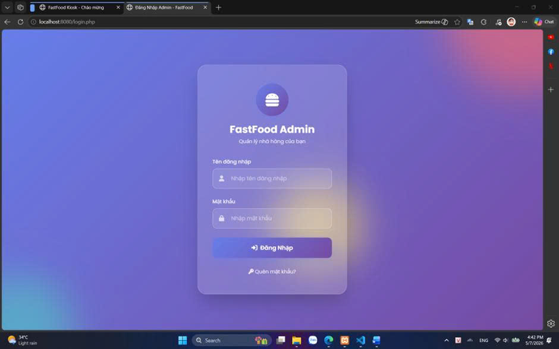
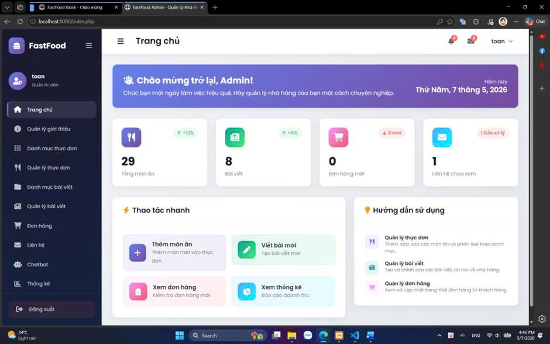
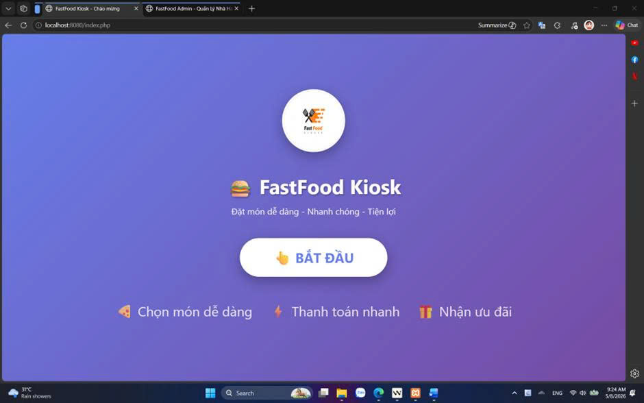
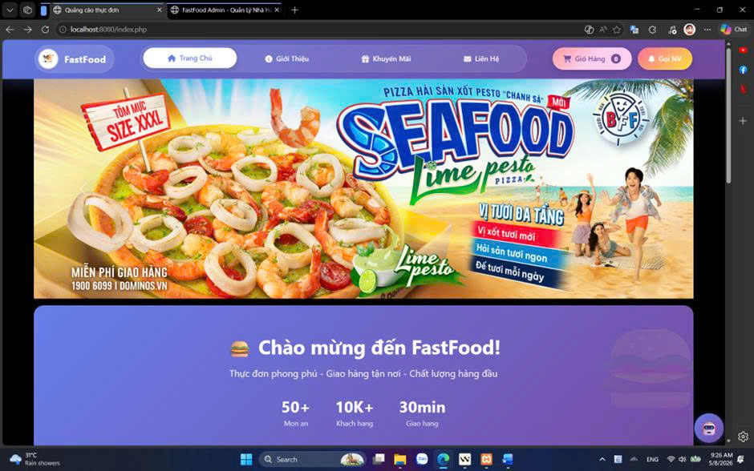
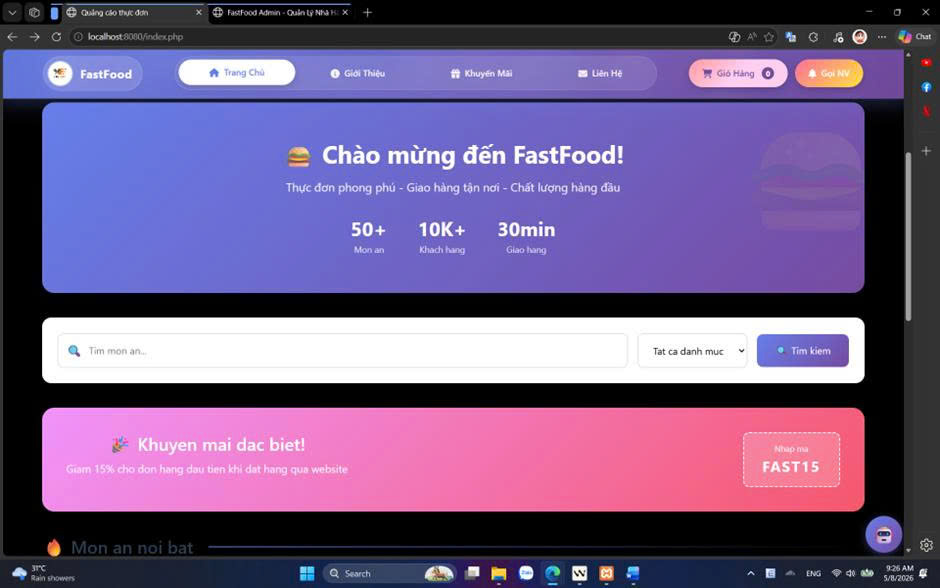
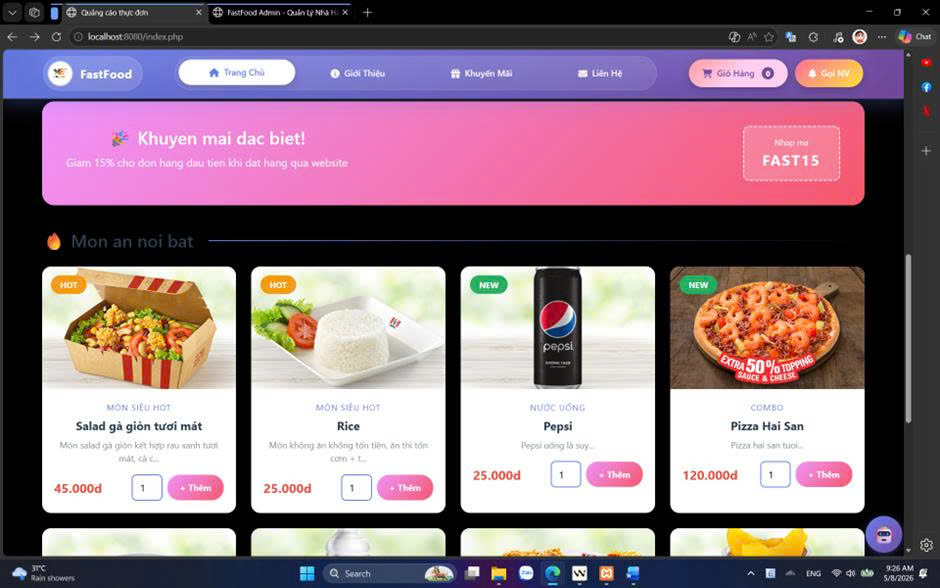
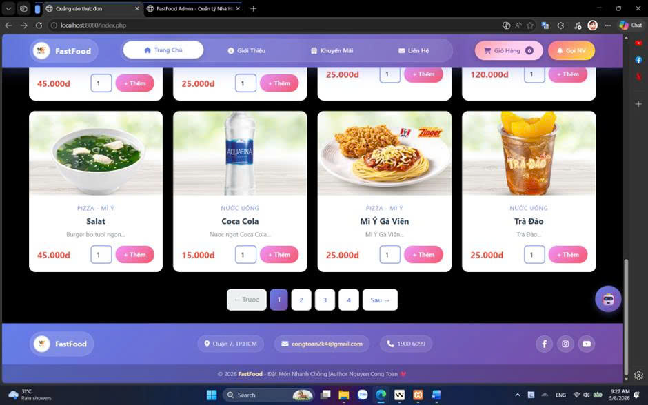

# 🍔 FastFood Kiosk - Hệ Thống Gọi Món Tự Động + AI Chatbot

<p align="center">
  
  
  
  
</p>

> 🎯 Hệ thống mô phỏng kiosk gọi món tự động cho cửa hàng thức ăn nhanh, có khu vực quản trị, giỏ hàng, thanh toán giả lập, quản lý hình ảnh động, gọi nhân viên và AI chatbot hỗ trợ khách hàng.

---

## 🚀 Demo Trực Tuyến

HR hoặc nhà tuyển dụng có thể truy cập trực tiếp bản demo tại:

| Khu vực | Link demo |
| --- | --- |
| Kiosk khách hàng | [👉 Mở Kiosk Demo](https://demo-projects.alwaysdata.net/view/index.php?reset=1) |
| Trang quản trị | [👉 Mở Admin Demo](https://demo-projects.alwaysdata.net/admincp/login.php) |

---

## 📋 Mục Lục

- [🚀 Demo trực tuyến](#-demo-trực-tuyến)
- [🧠 Tổng quan hệ thống](#-tổng-quan-hệ-thống)
- [📸 Ảnh minh họa](#-ảnh-minh-họa)
- [🔄 Luồng hoạt động](#-luồng-hoạt-động)
- [✨ Chức năng chính](#-chức-năng-chính)
- [📁 Cấu trúc dự án](#-cấu-trúc-dự-án)
- [🖼️ Cách lưu trữ hình ảnh](#️-cách-lưu-trữ-hình-ảnh)
- [⚙️ Cài đặt và chạy local](#️-cài-đặt-và-chạy-local)
- [🤖 Cấu hình Gemini AI](#-cấu-hình-gemini-ai)
- [🔐 Tính năng quên mật khẩu](#-tính-năng-quên-mật-khẩu)
- [🛡️ Bảo mật hệ thống](#️-bảo-mật-hệ-thống)
- [🧪 Smoke test tự động](#-smoke-test-tự-động)
- [✅ Checklist test thủ công](#-checklist-test-thủ-công)
- [🌐 Deploy demo 24/7](#-deploy-demo-247)
- [👤 Tài khoản demo](#-tài-khoản-demo)
- [🧑‍💻 Tác giả](#tac-gia)

---

## 🧠 Tổng Quan Hệ Thống

FastFood Kiosk được xây dựng để mô phỏng trải nghiệm đặt món tại màn hình kiosk trong cửa hàng thức ăn nhanh. Khách hàng có thể xem món, lọc danh mục, thêm vào giỏ hàng, thanh toán giả lập và nhận mã đơn. Admin có thể quản lý dữ liệu vận hành như món ăn, banner, hình ảnh hệ thống, đơn hàng, bài viết, liên hệ, chatbot và yêu cầu gọi nhân viên.

### ✨ Điểm nổi bật

| Điểm nổi bật | Mô tả |
| --- | --- |
| 🖥️ Kiosk tự phục vụ | Giao diện lớn, rõ, phù hợp màn hình cảm ứng hoặc demo desktop |
| 🧩 Quản trị đầy đủ | Admin quản lý món ăn, danh mục, bài viết, banner, hình ảnh hệ thống, đơn hàng, liên hệ, chatbot và yêu cầu hỗ trợ |
| 🖼️ Ảnh upload động | Ảnh sản phẩm, banner, logo được quản lý qua Admin và lưu trong `storage/uploads/` |
| 🤖 AI Chatbot | Chatbot hybrid kết hợp Gemini AI với rule/database, hỗ trợ context hội thoại và fallback khi AI không khả dụng |
| 🔔 Gọi nhân viên | Khách bấm gọi nhân viên, Admin nhận thông báo và xử lý |
| ⏱️ Timeout kiosk | Tự động quay về màn hình chờ khi không thao tác |
| 📤 Xuất dữ liệu | Admin có thể xuất CSV ở đơn hàng và lịch sử chatbot |
| 🛡️ Bảo mật tốt hơn | Admin action có login guard, CSRF token, prepared statement ở các luồng nhạy cảm |

---

## 📸 Ảnh Minh Họa

### 🔐 Khu vực Admin

**Trang đăng nhập Admin**



**Dashboard Admin**



### 👥 Khu vực khách hàng / Kiosk

**Màn hình chào mừng**



**Trang chọn món**






---

## 🔄 Luồng Hoạt Động

```text
Màn hình chờ
    |
    v
Trang chọn món
    |
    |-- Lọc danh mục
    |-- Xem chi tiết món
    |-- Thêm món vào giỏ
    |-- Chatbot hỗ trợ
    |-- Gọi nhân viên
    v
Giỏ hàng
    |
    |-- Cập nhật số lượng
    |-- Xóa món
    v
Thanh toán
    |
    |-- QR / Chuyển khoản
    |-- Tiền mặt
    v
Hoàn tất đơn hàng
    |
    v
Tự động quay về màn hình chờ
```

### 🔐 Luồng quản trị

```text
Admin đăng nhập
    |
    v
Dashboard
    |
    |-- Quản lý món ăn / danh mục
    |-- Quản lý banner / logo / favicon
    |-- Quản lý bài viết / liên hệ
    |-- Quản lý đơn hàng / xuất file
    |-- Theo dõi chatbot / xuất lịch sử
    |-- Nhận yêu cầu gọi nhân viên
    v
Cập nhật dữ liệu hiển thị cho kiosk
```

---

## ✨ Chức Năng Chính

### 👥 Khách hàng / Kiosk

| Chức năng | Mô tả |
| --- | --- |
| 🏁 Welcome screen | Màn hình chờ trước khi bắt đầu phiên đặt món |
| 🍽️ Danh sách món | Hiển thị món theo danh mục, có ảnh, giá, tồn kho và nút thêm |
| 🧭 Lọc danh mục | Chuyển nhanh tới nhóm món tương ứng |
| 🔎 Chi tiết món | Hiển thị ảnh lớn, mã món, giá, tồn kho, tóm tắt và nội dung chi tiết |
| 🛒 Giỏ hàng | Thêm món, sửa số lượng, xóa món, tính tổng tiền |
| 💳 Thanh toán | Giả lập thanh toán bằng QR/chuyển khoản hoặc tiền mặt |
| 🔔 Gọi nhân viên | Tạo yêu cầu hỗ trợ để Admin xử lý |
| 🤖 Chatbot | Hỏi về món ăn, giá, tồn kho, khuyến mãi và thông tin cửa hàng |
| ⏱️ Timeout | Tự reset phiên để phù hợp mô hình kiosk công cộng |

### 🔐 Admin

| Module | Chức năng |
| --- | --- |
| 🏠 Trang chủ | Dashboard tổng quan và cảnh báo hệ thống |
| 📊 Thống kê | Theo dõi dữ liệu vận hành |
| ℹ️ Giới thiệu | Quản lý nội dung giới thiệu website |
| 🖼️ Hình ảnh hệ thống | CRUD logo website, logo admin, favicon |
| 🏷️ Banner trang chủ | CRUD banner và cấu hình số banner hiển thị |
| 📂 Danh mục món ăn | Thêm, sửa, xóa danh mục thực đơn |
| 🍔 Món ăn | Thêm, sửa, xóa món; upload ảnh; quản lý giá, tồn kho, mô tả |
| 🗂️ Danh mục bài viết | Quản lý nhóm bài viết |
| 📰 Bài viết | Quản lý tin tức, khuyến mãi, nội dung marketing |
| 🧾 Đơn hàng | Xem danh sách, xem chi tiết, xóa đơn hàng, xuất CSV |
| ✉️ Liên hệ | Quản lý phản hồi khách hàng |
| 🤖 Chatbot | Xem lịch sử hội thoại, lọc theo loại, thống kê, xuất CSV |
| 🔔 Gọi nhân viên | Theo dõi và xử lý yêu cầu hỗ trợ từ kiosk |

---

## 📁 Cấu Trúc Dự Án

```text
Fast-Food-Self-Ordering-Kiosk-System-Web-Based/
|
|-- admincp/                         # Khu vực quản trị
|   |-- config/
|   |   `-- config.php
|   |
|   |-- css_admin/
|   |   |-- base/                    # CSS nền tảng Admin
|   |   |-- components/              # CSS component dùng chung
|   |   |-- layout/                  # Sidebar, topbar và layout Admin
|   |   |-- pages/                   # CSS riêng từng trang/module
|   |   |-- admin-responsive.css
|   |   |-- auth-forgot.css
|   |   |-- auth-login.css
|   |   `-- admin_style.css
|   |
|   |-- includes/
|   |   |-- admin_security.php       # Login guard + CSRF helper
|   |   `-- admin_shell_data.php     # Dữ liệu dùng chung Admin
|   |
|   |-- js_admin/
|   |   |-- pages/                   # JS riêng từng trang Admin
|   |   `-- admin_script.js
|   |
|   |-- modules/
|   |   |-- quanlysp/                # Quản lý món ăn
|   |   |-- quanlydanhmuc/           # Quản lý danh mục món
|   |   |-- quanlybaiviet/           # Quản lý bài viết
|   |   |-- quanlydanhmucbaiviet/    # Quản lý danh mục bài viết
|   |   |-- quanlybanner/            # Quản lý banner
|   |   |-- quanlyhinhanh/           # Quản lý logo/favicon
|   |   |-- quanlydonhang/           # Quản lý đơn hàng
|   |   |-- quanlylienhe/            # Quản lý liên hệ
|   |   |-- quanlychatbot/           # Quản lý chatbot
|   |   |-- quanlyhotro/             # Quản lý gọi nhân viên
|   |   |-- thongke/                 # Thống kê
|   |   `-- thongtinweb/             # Quản lý thông tin website
|   |
|   |-- forgot_password.php
|   |-- index.php
|   `-- login.php
|
|-- config/                           # Cấu hình và repository dùng chung
|   |-- database.php
|   |-- paths.php
|   |-- site_asset_repository.php
|   |-- banner_repository.php
|   |-- kiosk_order_repository.php
|   |-- order_notification_repository.php
|   |-- staff_call_repository.php
|   |-- chatbot_ai_config.php
|   |-- chatbot_ai_secret.example.php
|   |-- chatbot_context_repository.php
|   `-- gemini_chatbot_client.php
|
|-- storage/
|   `-- uploads/                      # Ảnh upload khi chạy hệ thống
|       |-- banners/
|       |-- posts/
|       |-- products/
|       `-- site/
|
|-- tests/
|   `-- smoke/                        # Smoke test tự động
|       |-- README.md
|       |-- SmokeTestResult.php
|       `-- run_smoke_tests.php
|
|-- view/                             # Giao diện khách hàng / kiosk
|   |-- assets/
|   |   |-- banners/
|   |   |-- brand/
|   |   |-- placeholders/
|   |   |-- screenshots/
|   |   `-- seed/
|   |
|   |-- config/
|   |   `-- config.php
|   |
|   |-- controllers/
|   |   |-- cart_controller.php
|   |   |-- checkout_controller.php
|   |   |-- contact_controller.php
|   |   `-- kiosk_session_controller.php
|   |
|   |-- css/                          # CSS frontend/kiosk
|   |-- images/                       # Ảnh giao diện/dữ liệu cũ
|   |
|   |-- js/                           # JavaScript frontend/kiosk
|   |   |-- chatbot-widget.js        # UI và tương tác widget chatbot
|   |   |-- checkout-page.js         # Xử lý giao diện thanh toán
|   |   |-- home-page.js             # Xử lý giao diện trang chọn món
|   |   |-- order-success.js         # Xử lý trang hoàn tất đơn hàng
|   |   |-- timeout.js               # Quản lý timeout phiên kiosk
|   |   `-- chatbot/
|   |       |-- chatbot-utils.js      # Chuẩn hóa văn bản và tiện ích dùng chung
|   |       |-- chatbot-context.js    # Quản lý context hội thoại/localStorage
|   |       |-- chatbot-intents.js    # Nhận diện intent người dùng
|   |       |-- chatbot-catalog.js    # Tìm kiếm món ăn và danh mục
|   |       |-- chatbot-api.js        # Giao tiếp với backend PHP API
|   |       |-- chatbot-responses.js  # Xử lý phản hồi rule/database/AI
|   |       `-- chatbot-response-service.js
|   |                                    # Điều phối luồng xử lý chatbot
|   |
|   |-- pages/
|   |   |-- chatbot.php
|   |   |-- footer.php
|   |   |-- header.php
|   |   |-- main.php
|   |   |-- menu.php
|   |   `-- main/
|   |       |-- welcome.php
|   |       |-- index.php
|   |       |-- sanpham.php
|   |       |-- danhmuc.php
|   |       |-- danhmuc_page_data.php
|   |       |-- giohang.php
|   |       |-- thanhtoan.php
|   |       |-- camon.php
|   |       |-- baiviet.php
|   |       |-- danhmucbaiviet.php
|   |       |-- gioithieu.php
|   |       |-- contact.php
|   |       |-- lienhe.php
|   |       |-- goinhanvien.php
|   |       |-- reset_session.php
|   |       `-- chatbot_api.php
|   |
|   `-- index.php
|
|-- web_sqli.sql                      # Script database
|-- .gitignore
`-- README.md
```

---

## 🖼️ Cách Lưu Trữ Hình Ảnh

Dự án không lưu binary ảnh trực tiếp trong database. Cách làm hiện tại chuyên nghiệp hơn cho demo và deploy:

- File ảnh upload từ Admin lưu trong `storage/uploads/`.
- Database chỉ lưu tên file hoặc đường dẫn tương đối.
- Frontend và Admin cùng đọc ảnh qua helper/repository dùng chung.
- Ảnh tĩnh phục vụ giao diện, screenshot hoặc dữ liệu seed được đặt trong `view/assets/`.
- Với bản demo/portfolio, một số ảnh demo cần thiết trong `storage/uploads/` được Git theo dõi để khi clone/deploy lại vẫn hiển thị đầy đủ dữ liệu mẫu; các ảnh runtime phát sinh mới vẫn có thể được `.gitignore` bỏ qua.
- Khi deploy, server phải cấp quyền ghi cho `storage/uploads/`.

### 🧩 Các nhóm ảnh Admin có thể chỉnh

| Nhóm ảnh | Nơi quản lý | Ảnh hưởng |
| --- | --- | --- |
| 🍔 Ảnh món ăn | Admin > Món ăn | Hiển thị ở trang chủ, danh mục, chi tiết món và giỏ hàng |
| 🏷️ Banner trang chủ | Admin > Banner trang chủ | Hiển thị ở carousel/banner frontend |
| 🖥️ Logo website | Admin > Hình ảnh hệ thống | Hiển thị ở frontend |
| 🔐 Logo admin | Admin > Hình ảnh hệ thống | Hiển thị ở sidebar/trang đăng nhập admin |
| ⭐ Favicon | Admin > Hình ảnh hệ thống | Hiển thị trên tab trình duyệt |

---

## ⚙️ Cài Đặt Và Chạy Local

### 📌 Yêu cầu

| Thành phần | Phiên bản khuyến nghị |
| --- | --- |
| PHP | 8.x |
| MySQL / MariaDB | MySQL 5.7+ hoặc MariaDB tương đương |
| XAMPP | Bản mới ổn định |
| Trình duyệt | Chrome, Edge hoặc Firefox |

### 🚀 Các bước chạy

1. Đặt source vào:

```text
C:\xampp\htdocs\web_mysqli
```

2. Mở XAMPP Control Panel và start:

```text
Apache
MySQL
```

3. Vào phpMyAdmin:

```text
http://localhost/phpmyadmin
```

4. Tạo database:

```text
web_sqli
```

5. Import file:

```text
web_sqli.sql
```

6. Kiểm tra cấu hình database:

```text
config/database.php
```

File này hỗ trợ các biến môi trường `DB_HOST`, `DB_USER`, `DB_PASS`, `DB_NAME`, `DB_PORT`. Nếu không khai báo, cấu hình local mặc định là `localhost`, user `root`, password rỗng và database `web_sqli`.

7. Mở hệ thống:

| Khu vực | URL |
| --- | --- |
| Customer / Kiosk | `http://localhost/web_mysqli/view/` |
| Admin | `http://localhost/web_mysqli/admincp/login.php` |

---

## 🤖 Cấu Hình Gemini AI

Chatbot sử dụng kiến trúc hybrid giữa rule/database và Gemini AI:

1. Các yêu cầu cần dữ liệu chính xác như giá, tồn kho, danh mục và đặt món được xử lý trực tiếp bằng rule và dữ liệu trong database.
2. Các câu hỏi mang tính tư vấn hoặc gợi ý món được ưu tiên xử lý bằng Gemini để tạo phản hồi tự nhiên hơn.
3. Các câu hỏi mở không khớp với rule cụ thể có thể được chuyển tiếp sang Gemini.
4. Nếu Gemini không khả dụng, API lỗi, hết quota hoặc chưa cấu hình key, hệ thống sử dụng rule/database fallback để chatbot vẫn hoạt động.

### 🧩 Kiến trúc Chatbot

Frontend chatbot được tách thành các module độc lập theo trách nhiệm:

| Module | Trách nhiệm |
| --- | --- |
| `chatbot-utils.js` | Chuẩn hóa văn bản, xử lý keyword, số lượng và các hàm tiện ích dùng chung |
| `chatbot-context.js` | Quản lý context hội thoại và ghi nhớ món/danh mục bằng `localStorage` |
| `chatbot-intents.js` | Phân loại ý định như đặt món, hỏi giá, tồn kho, tư vấn và gợi ý |
| `chatbot-catalog.js` | Tìm kiếm và đối chiếu món ăn/danh mục từ dữ liệu sản phẩm |
| `chatbot-api.js` | Giao tiếp giữa frontend với PHP API |
| `chatbot-responses.js` | Xử lý phản hồi từ rule, database, giỏ hàng và Gemini |
| `chatbot-response-service.js` | Điều phối thứ tự xử lý và cơ chế fallback của chatbot |
| `chatbot-widget.js` | Quản lý giao diện và tương tác của widget chatbot |

Luồng xử lý được thiết kế để các thao tác cần độ chính xác cao như giá, tồn kho và đặt món sử dụng dữ liệu hệ thống, trong khi các yêu cầu tư vấn hoặc hội thoại mở có thể sử dụng Gemini AI.

### 🔑 Tạo file secret local

Chạy trong PowerShell tại thư mục dự án:

```powershell
Copy-Item config\chatbot_ai_secret.example.php config\chatbot_ai_secret.php
```

Mở file:

```text
config/chatbot_ai_secret.php
```

Điền key:

```php
<?php
return [
    'api_key' => 'GEMINI_API_KEY_CUA_BAN',
];
```

### 🧪 Kiểm tra key local

```powershell
php -r "require 'config/chatbot_ai_config.php'; `$c = chatbot_ai_config(); echo `$c['api_key'] ? 'KEY_OK' : 'NO_KEY';"
```

Nếu trả về `KEY_OK` là đã đọc được key.

### 💬 Test chatbot API thủ công

```powershell
$body = @{ message = "Tôi muốn món nhẹ, rẻ, còn hàng thì nên chọn gì?" } | ConvertTo-Json

Invoke-WebRequest `
  -Uri "http://localhost/web_mysqli/view/pages/main/chatbot_api.php?action=ai_chat" `
  -Method POST `
  -Body $body `
  -ContentType "application/json; charset=utf-8" `
  -UseBasicParsing
```

---

## 🔐 Tính Năng Quên Mật Khẩu

Trang quên mật khẩu nằm tại:

```text
http://localhost/web_mysqli/admincp/forgot_password.php
```

Luồng xử lý:

1. Admin nhập tên đăng nhập.
2. Hệ thống hiển thị câu hỏi bảo mật nếu tài khoản có cấu hình.
3. Admin nhập câu trả lời và mật khẩu mới.
4. Mật khẩu mới phải có ít nhất 8 ký tự và được lưu bằng `password_hash`.

Lưu ý:

- Tài khoản cũ dùng MD5 vẫn có đường nâng cấp khi đăng nhập thành công.
- Tài khoản cần có câu hỏi và câu trả lời bảo mật để sử dụng chức năng quên mật khẩu.

---

## 🛡️ Bảo Mật Hệ Thống

Các điểm đã được gia cố:

- `admincp/index.php` yêu cầu đăng nhập admin.
- Tất cả file xử lý trong `admincp/modules/**/xuly.php` có login guard.
- Các hành động thêm/sửa/xóa trong Admin có CSRF token.
- Endpoint lịch sử/thống kê chatbot yêu cầu đăng nhập admin.
- Endpoint chatbot public chỉ phục vụ chức năng khách hàng cần dùng.
- Login và quên mật khẩu dùng prepared statement.
- Mật khẩu mới dùng `password_hash`.
- File secret Gemini được tách riêng và bị ignore khỏi Git.
- Ảnh upload được quản lý trong `storage/uploads/`; một số ảnh demo cần thiết có thể được Git theo dõi để phục vụ backup và deploy.

---

## 🧪 Smoke Test Tự Động

Bộ test nhanh nằm trong `tests/smoke/`, dùng để kiểm tra dự án còn chạy ổn trước khi commit hoặc deploy demo.

Chạy local với XAMPP:

```powershell
php tests/smoke/run_smoke_tests.php
```

Nếu dự án chạy ở URL khác:

```powershell
php tests/smoke/run_smoke_tests.php http://localhost/web_mysqli
```

Smoke test hiện tại kiểm tra:

- Các file PHP quan trọng được chọn không có lỗi cú pháp.
- Trang public chính trả về HTTP hợp lệ và không có lỗi PHP.
- Chatbot API trả về JSON hợp lệ.
- Các endpoint xử lý Admin bị chặn khi chưa đăng nhập.
- File secret AI được Git ignore.
- Thư mục upload có `.htaccess` và `.gitkeep`.

Đây là smoke test thực dụng cho dự án PHP/MySQLi, không thay thế PHPUnit đầy đủ nhưng đủ giúp phát hiện lỗi nghiêm trọng trước khi demo.

---

## ✅ Checklist Test Thủ Công

### 🖥️ Test kiosk

| Bước | Thao tác | Kết quả mong đợi |
| --- | --- | --- |
| 1 | Mở `http://localhost/web_mysqli/view/` | Hiện màn hình welcome |
| 2 | Bấm `Bắt đầu` | Vào trang chọn món |
| 3 | Lọc danh mục | Danh sách món cuộn/chuyển đúng nhóm |
| 4 | Thêm món | Số lượng giỏ hàng cập nhật đúng |
| 5 | Vào giỏ hàng | Hiển thị đúng món, số lượng và tổng tiền |
| 6 | Cập nhật số lượng | Tổng tiền thay đổi đúng |
| 7 | Thanh toán | Tạo đơn hàng và hiển thị hoàn tất |
| 8 | Chờ timeout | Quay về màn hình welcome |
| 9 | Bấm `Gọi NV` | Admin nhận được yêu cầu hỗ trợ |

### 🔐 Test admin

| Bước | Thao tác | Kết quả mong đợi |
| --- | --- | --- |
| 1 | Đăng nhập Admin | Vào dashboard |
| 2 | Thêm/sửa món ăn | Dữ liệu cập nhật ở frontend |
| 3 | Upload ảnh món | Ảnh lưu trong `storage/uploads/` và hiển thị đúng |
| 4 | Sửa banner | Banner frontend thay đổi |
| 5 | Sửa logo/favicon | Giao diện dùng ảnh mới |
| 6 | Kiểm tra đơn hàng | Đơn từ kiosk xuất hiện trong Admin |
| 7 | Xuất đơn hàng | Tải CSV thành công |
| 8 | Mở chatbot Admin | Xem được lịch sử và lọc theo loại |
| 9 | Xuất lịch sử chatbot | Tải CSV thành công |
| 10 | Xử lý gọi nhân viên | Trạng thái yêu cầu được cập nhật |

### 🛡️ Test bảo mật nhanh

| Kiểm tra | Kết quả mong đợi |
| --- | --- |
| Mở trực tiếp `admincp/modules/.../xuly.php` khi chưa login | Bị chuyển về login |
| Gọi API lịch sử chatbot khi chưa login | Trả về `401` |
| Submit form Admin không có CSRF token | Bị chặn |
| File `config/chatbot_ai_secret.php` | Không xuất hiện trong commit |

---

## 🌐 Deploy Demo 24/7

Cấu hình deploy trên hosting demo gồm:

1. Tạo database MySQL/MariaDB trên hosting.
2. Import `web_sqli.sql`.
3. Cấu hình kết nối database bằng biến môi trường, không hard-code mật khẩu vào source:
   - `DB_HOST`
   - `DB_PORT`
   - `DB_NAME`
   - `DB_USER`
   - `DB_PASS`
4. Deploy source từ GitHub lên hosting.
5. Đảm bảo `storage/uploads/` có quyền ghi.
6. Cấu hình Gemini API key bằng biến môi trường hoặc file secret không public.
7. Kiểm tra lại các URL:

| Khu vực | Đường dẫn |
| --- | --- |
| Kiosk | `/view/` |
| Admin | `/admincp/login.php` |

Lưu ý quan trọng:

- Nếu hosting không cho ghi file, upload ảnh từ Admin sẽ lỗi.
- Không đưa API key vào GitHub public.

---


## 👤 Tài Khoản Demo

```text
URL Admin: https://demo-projects.alwaysdata.net/admincp/login.php
Username: toan
Password: 12345678
```

Đây là tài khoản demo dành cho HR hoặc người xem dự án đăng nhập nhanh, phục vụ mục đích demo/portfolio.

---

<a id="tac-gia"></a>

## 🧑‍💻 Tác Giả

```text
Nguyễn Công Toàn
GitHub: https://github.com/Szero-White
Email: congtoan2k4@gmail.com
```

---

## 📚 Tài Liệu Tham Khảo

| File | Mô tả |
| --- | --- |
| `web_sqli.sql` | Script database |
